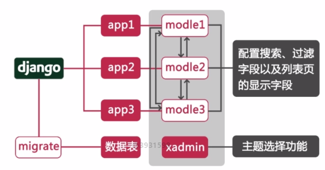

# django_study
学习Django的demo

1. [资产管理系统](http://liujiangblog.com/course/django/)
参考源码：https://github.com/feixuelove1009/liujiangblog_project_2

1. [Django搭建blog](https://github.com/jhao104/django-blog)、[基于Django的博客系统](https://github.com/liangliangyy/DjangoBlog)

1. [最新Django2\.0\.1在线教育零基础到上线教程](https://www.jianshu.com/nb/21010157)
参考源码：
https://github.com/mtianyan/Mxonline3

1. [高仿慕课网：py3.5 + Django1.10 + xadmin 搭建的在线课程教育平台](https://github.com/zaxlct/imooc-django)  http://118.25.37.219
